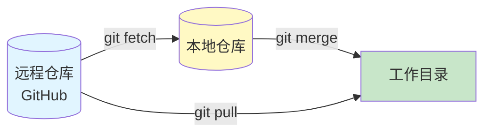
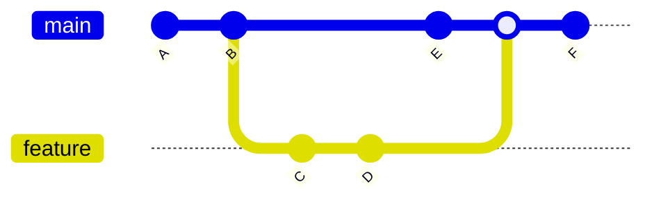
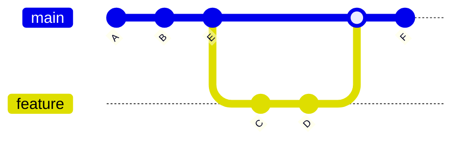
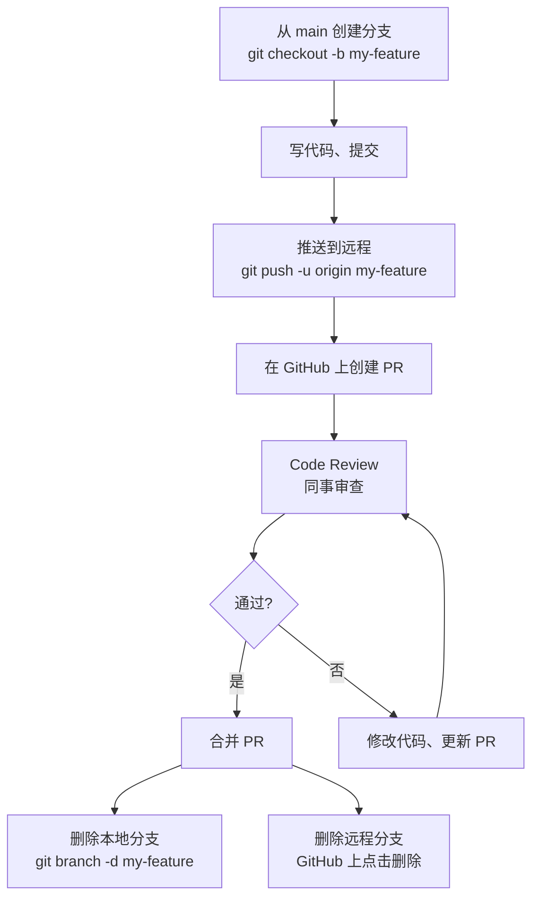

# Git & GitHub 进阶教程

补充之前没讲到的核心内容！

---

## 第一部分：Git 进阶操作

### 1. git pull vs git fetch — 别搞混了！



#### git fetch（安全！推荐！）
```bash
# 下载远程更新，但不修改你的代码
git fetch origin

# 看看远程有什么新东西
git log origin/master..master  # 本地有但远程没有的
git log master..origin/master  # 远程有但本地没有的

# 确认没问题后再合并
git merge origin/master
```

**为什么推荐？**
- 安全！先看看有什么更新，再决定要不要合并
- 避免意外覆盖你的代码

#### git pull（快捷，但有风险）
```bash
# git pull = git fetch + git merge（一步到位）
git pull origin master
```

**什么时候用？**
- 确定远程没有冲突时
- 只有你一个人用这个分支时

---

### 2. git rebase — 让提交历史更干净

#### 什么是 rebase？

对比一下：

**合并（merge）的历史：**


**变基（rebase）的历史：**


#### 实际操作

```bash
# 在 feature 分支上
git checkout feature

# 把 feature 分支的提交"移动"到 master 最新提交后面
git rebase master

# 如果有冲突，解决后：
git add <冲突文件>
git rebase --continue

# 想中止 rebase
git rebase --abort
```

#### 什么时候用 rebase？

✅ **用 rebase：**
- 你的分支还没推送到远程
- 想让提交历史是一条直线，更清晰
- 个人开发的分支

❌ **别用 rebase：**
- 你的分支已经推送到远程，别人也在用
- 公共分支（master/main）

---

### 3. .gitignore 详解

#### 什么是 .gitignore？

告诉 Git：**这些文件别管我！**

#### 常见的 .gitignore 内容

```gitignore
# 依赖目录
node_modules/
venv/
__pycache__/

# 操作系统文件
.DS_Store
Thumbs.db

# 编辑器配置
.vscode/
.idea/
*.swp
*.swo

# 环境变量（别提交密码！）
.env
.env.local

# 编译产物
dist/
build/
*.pyc

# 日志文件
*.log
npm-debug.log*
```

#### 常用规则

```gitignore
# 忽略某个文件
secret.txt

# 忽略某种类型的文件
*.log

# 忽略某个目录
temp/

# 不忽略某个文件（用 ! ）
!important.log

# 只忽略根目录的某个文件（用 / ）
/todo.txt  # 只忽略根目录的 todo.txt，子目录的不管
```

#### 已经提交的文件怎么忽略？

```bash
# 1. 先从 Git 跟踪中移除（但不删除本地文件）
git rm --cached <文件名>

# 2. 加到 .gitignore
echo "<文件名>" >> .gitignore

# 3. 提交
git add .gitignore
git commit -m "Stop tracking <文件名>"
```

---

## 第二部分：GitHub 协作流程

### 1. Pull Request (PR) 完整流程



#### 详细步骤

**第一步：创建分支**
```bash
git checkout main
git pull origin main  # 先拉取最新代码
git checkout -b feature/user-login
```

**第二步：写代码、提交**
```bash
# ... 写代码 ...
git add .
git commit -m "feat: add user login functionality"
```

**第三步：推送到远程**
```bash
git push -u origin feature/user-login
```

**第四步：在 GitHub 上创建 PR**
1. 访问你的仓库
2. 点击 "Compare & pull request"
3. 填写 PR 描述：
   - 做了什么
   - 为什么这么做
   - 测试了什么
4. 点击 "Create pull request"

**第五步：Code Review**
- 同事可以评论你的代码
- 可以在具体代码行上留言
- 你可以修改后再次 push（PR 会自动更新）

**第六步：合并**
- 审查通过后，点击 "Merge pull request"
- 选择 "Squash and merge"（把多个提交合并成一个）

---

### 2. Code Review 该看什么？

#### PR 审查清单

- [ ] **代码逻辑正确吗？**
  - 有没有明显的 bug？
  - 边界条件处理了吗？

- [ ] **代码清晰吗？**
  - 变量名有意义吗？
  - 需要加注释吗？
  - 函数是不是太长了？

- [ ] **有测试吗？**
  - 新功能有对应的测试吗？
  - 所有测试都通过了吗？

- [ ] **安全吗？**
  - 有没有密码/密钥提交了？
  - 有没有 SQL 注入风险？
  - 用户输入验证了吗？

- [ ] **性能考虑**
  - 有没有 N+1 查询？
  - 大数据量时会慢吗？

---

### 3. Issues 项目管理

#### 什么是 Issue？

- Bug 报告
- 功能请求
- 任务跟踪
- 讨论

#### Issue 模板（建议）

**Bug Report：**
```markdown
**描述 bug：**
清楚地描述 bug 是什么

**复现步骤：**
1. 去 '...'
2. 点击 '....'
3. 看到错误

**预期行为：**
你觉得应该发生什么

**实际行为：**
实际上发生了什么

**截图：**
如果适用

**环境：**
- OS: [e.g. macOS 13]
- 浏览器: [e.g. Chrome 110]
```

**Feature Request：**
```markdown
**功能描述：**
你想要什么功能

**为什么需要：**
这个功能解决什么问题

**替代方案：**
有没有其他办法

**额外信息：**
其他想说的
```

---

## 第三部分：GitHub CLI 高级用法

### 1. 常用 gh 命令

#### 仓库相关
```bash
# 创建仓库（之前用过）
gh repo create my-repo --public --source=. --push

# 克隆仓库
gh repo clone owner/repo

# 查看仓库信息
gh repo view

# 查看仓库的 Issues
gh issue list

# 查看仓库的 PR
gh pr list
```

#### Issue 相关
```bash
# 创建 Issue
gh issue create --title "Bug: Login fails" --body "描述..."

# 查看 Issue
gh issue view 123

# 关闭 Issue
gh issue close 123

# 给 Issue 加标签
gh issue edit 123 --add-label bug --add-label "help wanted"
```

#### PR 相关
```bash
# 创建 PR
gh pr create --title "feat: add login" --body "描述..."

# 查看 PR 状态
gh pr status

# 查看 PR 差异
gh pr diff 123

# 查看 PR 评论
gh pr view 123 --comments

# 合并 PR
gh pr merge 123 --squash  # 或 --merge, --rebase

# 切换到某个 PR 的分支
gh pr checkout 123
```

#### 其他有用的
```bash
# 打开当前仓库的网页
gh repo view --web

# 打开某个 Issue
gh issue view 123 --web

# 查看你的 Gists
gh gist list

# 搜索 GitHub
gh search repos "git demo in:name language:python"
```

---

## 第四部分：团队协作最佳实践

### 1. 分支命名规范

```
<type>/<description>

类型：
- feature/  - 新功能
- fix/      - 修复 bug
- hotfix/   - 紧急修复
- docs/     - 文档更新
- refactor/ - 重构
- test/     - 测试相关

示例：
feature/user-login
fix/checkout-bug
docs/update-api
```

### 2. Commit Message 规范（Conventional Commits）

```
<type>(<scope>): <description>

类型：
- feat:     新功能
- fix:      修复 bug
- docs:     文档更新
- style:    代码格式（不影响逻辑）
- refactor: 重构（既不新增功能，也不修复 bug）
- perf:     性能优化
- test:     测试相关
- chore:    构建/工具链相关

示例：
feat(auth): add JWT token refresh
fix(checkout): resolve race condition in payment
docs: update API documentation for v2
style: format code with prettier
```

### 3. 代码合并策略

| 策略 | 适用场景 | 优点 | 缺点 |
|------|---------|------|------|
| **Merge commit** | 保留完整历史 | 能看到分支合并点 | 历史比较乱 |
| **Squash and merge** | 功能分支 | 历史干净，一个功能一个提交 | 丢失详细提交历史 |
| **Rebase and merge** | 个人分支 | 一条直线，最清晰 | 不能在公共分支用 |

---

## 第五部分：实用 Git 技巧

### 1. 撤销操作大全

```bash
# 场景1：改了文件但还没 add
git checkout -- <文件名>  # 丢弃修改
git restore <文件名>       # Git 2.23+ 新命令

# 场景2：已经 add 但还没 commit
git reset HEAD <文件名>     # 从暂存区移除
git restore --staged <文件名>  # Git 2.23+

# 场景3：已经 commit 但还没 push
git reset --soft HEAD~1  # 撤销 commit，保留代码
git reset --mixed HEAD~1 # 撤销 commit，保留代码但取消 add（默认）
git reset --hard HEAD~1  # 撤销 commit，丢弃代码（危险！）

# 场景4：已经 push 了
git revert <commit-hash>  # 创建一个新提交来撤销（安全）
# 不要用 git reset --hard 然后强制推送！
```

### 2. 临时保存代码（git stash）

```bash
# 正在写代码，突然要切换分支
git stash  # 保存当前工作区

# 查看保存的列表
git stash list

# 恢复最近的 stash
git stash pop

# 恢复指定的 stash
git stash apply stash@{1}

# 删除 stash
git stash drop stash@{1}
git stash clear  # 删除所有
```

### 3. 查看历史的技巧

```bash
# 好看的 log
git log --graph --pretty=format:'%C(auto)%h%d %s %C(green)(%cr) %C(bold blue)<%an>%Creset' --abbrev-commit

# 只看某个人的提交
git log --author="张三"

# 只看某个文件的历史
git log --follow -p <文件名>

# 搜索提交信息
git log --grep="bug"

# 看某行代码是谁写的
git blame <文件名>

# 看某次提交改了什么
git show <commit-hash>
```

---

## 总结

### Git 核心要点：
1. ✅ 优先用 `git fetch` + `git merge`，安全
2. ✅ `git rebase` 让历史更干净，但别在公共分支用
3. ✅ `.gitignore` 很重要，别提交密码
4. ✅ 学会 `git stash`，切换分支神器

### GitHub 协作要点：
1. ✅ PR 流程：分支 → 写代码 → push → 创建 PR → 审查 → 合并
2. ✅ Code Review 要认真看：逻辑、清晰、测试、安全
3. ✅ Issues 用来跟踪问题和功能
4. ✅ 分支命名和 commit message 要规范

### GitHub CLI 要点：
1. ✅ `gh pr create` - 创建 PR 超方便
2. ✅ `gh issue` - 管理 Issues 不用开网页
3. ✅ `gh repo view --web` - 快速打开仓库

现在你的 Git & GitHub 技能已经从入门到进阶了！🎉
