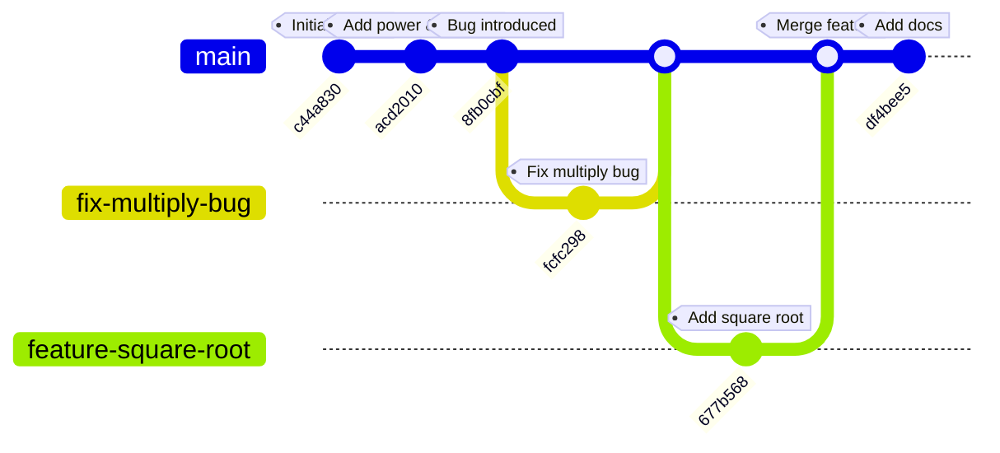
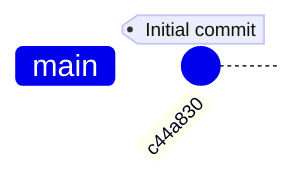
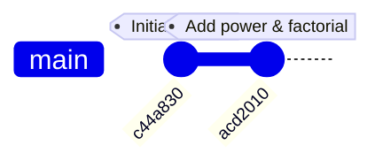
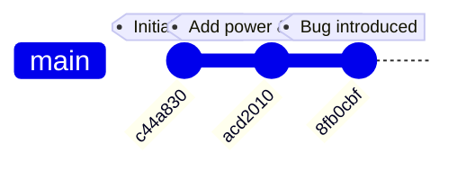
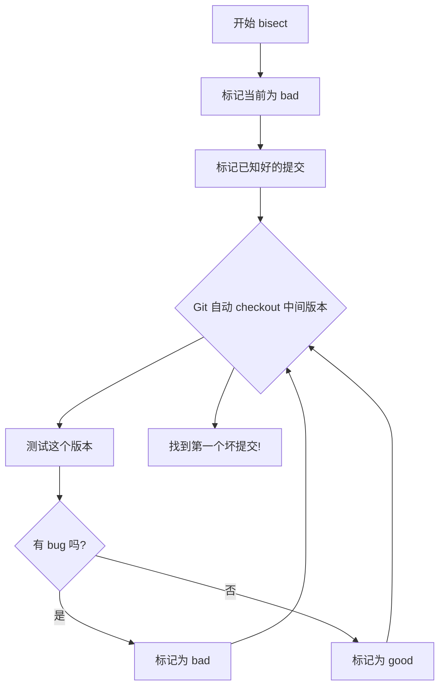
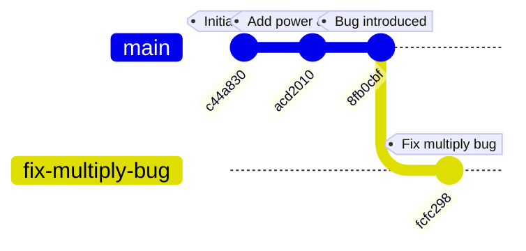
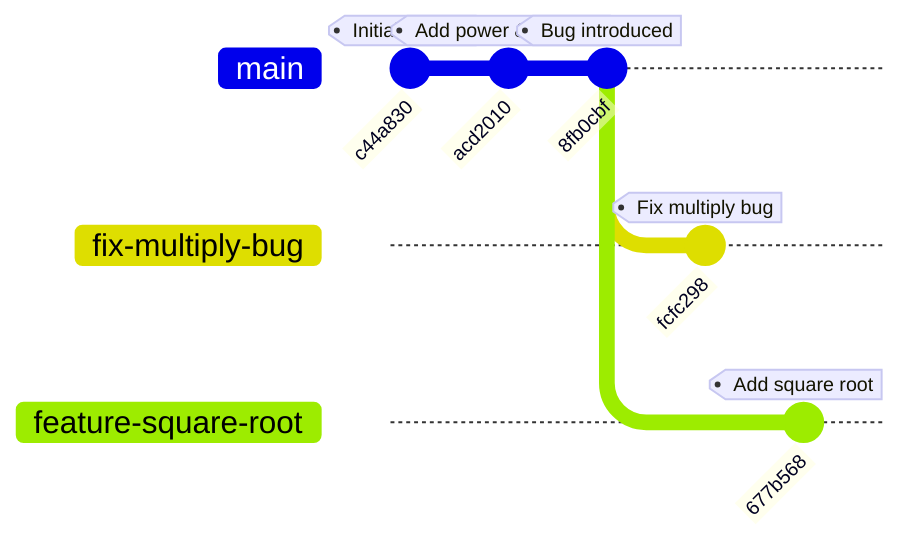
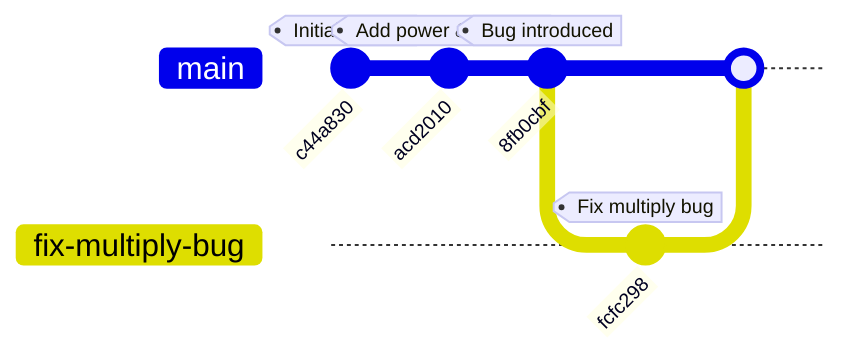
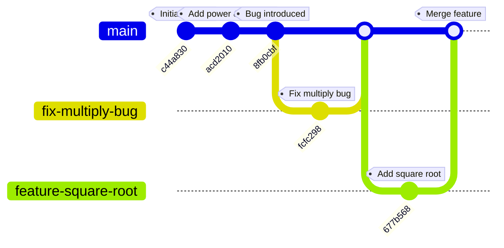

# Git 精妙之处实战教程

通过一个完整的计算器项目，带你体验 Git 的强大功能！

---

## 项目概述

我们从一个简单的计算器开始，逐步体验 Git 的各种功能：



---

## 第一步：初始化项目

```bash
mkdir git-demo && cd git-demo
git init
```

创建 `calculator.py`：

```python
def add(a, b):
    return a + b

def subtract(a, b):
    return a - b

def multiply(a, b):
    return a * b

def divide(a, b):
    if b == 0:
        raise ValueError("Cannot divide by zero")
    return a / b

if __name__ == "__main__":
    print(f"2 + 3 = {add(2, 3)}")
    print(f"5 - 2 = {subtract(5, 2)}")
    print(f"4 * 3 = {multiply(4, 3)}")
    print(f"10 / 2 = {divide(10, 2)}")
```

第一次提交：

```bash
git add calculator.py
git commit -m "Initial commit: Add basic calculator functions"
```



---

## 第二步：添加新功能

添加幂运算和阶乘：

```python
def power(a, b):
    return a ** b

def factorial(n):
    if n < 0:
        raise ValueError("Factorial not defined for negative numbers")
    if n == 0 or n == 1:
        return 1
    return n * factorial(n - 1)

if __name__ == "__main__":
    print(f"2 + 3 = {add(2, 3)}")
    print(f"5 - 2 = {subtract(5, 2)}")
    print(f"4 * 3 = {multiply(4, 3)}")
    print(f"10 / 2 = {divide(10, 2)}")
    print(f"2^5 = {power(2, 5)}")
    print(f"5! = {factorial(5)}")
```

第二次提交：

```bash
git add calculator.py
git commit -m "Add power and factorial functions"
```



---

## 第三步：引入 Bug（故意的！）

现在我们故意引入一个 bug：

```python
def multiply(a, b):
    return a + b  # BUG: 这里写错了！
```

提交这个有 bug 的版本：

```bash
git add calculator.py
git commit -m "Optimize multiply function (intentional bug)"
```



---

## Git 精妙之处 #1：二分查找定位 Bug (git bisect)

假设过了很久，我们发现乘法不对了，但不知道是哪个提交引入的 bug。这时候 `git bisect` 就派上用场了！



实际操作：

```bash
# 启动 bisect
git bisect start

# 标记当前版本为 bad（有 bug）
git bisect bad HEAD

# 标记初始版本为 good（没 bug）
git bisect good c44a830

# Git 会自动 checkout 到中间版本，你测试后告诉它结果
git bisect good  # 或 git bisect bad

# 最终 Git 会告诉你第一个引入 bug 的提交！
```

结果：

```
8fb0cbfcbc8c5dc696db7837fbfcea3ac31dc52b is the first bad commit
commit 8fb0cbf
Author: Demo User <demo@example.com>
Date:   Sun Feb 15 15:32:52 2026 +0800

    Optimize multiply function (intentional bug)
```

完成后重置：

```bash
git bisect reset
```

---

## Git 精妙之处 #2：分支（平行宇宙）

现在让我们创建分支来修复 bug 和开发新功能！

### 创建修复分支

```bash
# 创建并切换到修复分支
git checkout -b fix-multiply-bug
```

修复 bug：

```python
def multiply(a, b):
    return a * b  # 修复了！
```

提交修复：

```bash
git add calculator.py
git commit -m "Fix: Correct multiply function"
```



### 创建新功能分支

同时，在另一个平行宇宙里开发新功能：

```bash
# 先切回 master
git checkout master

# 创建新功能分支
git checkout -b feature-square-root
```

添加平方根功能（注意：这里 bug 还没修复！）：

```python
def square_root(n):
    if n < 0:
        raise ValueError("Square root not defined for negative numbers")
    return n ** 0.5

if __name__ == "__main__":
    # ... 前面的打印 ...
    print(f"sqrt(16) = {square_root(16)}")
```

提交新功能：

```bash
git add calculator.py
git commit -m "Add square_root function"
```



---

## Git 精妙之处 #3：优雅合并

现在我们有两个分支，让我们把它们合并到 master！

### 先合并 bug 修复

```bash
git checkout master
git merge fix-multiply-bug
```

这是一个「Fast-forward」合并，因为 master 没有新的提交：



### 再合并新功能

```bash
git merge feature-square-root
```

这次是真正的合并，Git 会创建一个合并提交：



---

## Git 精妙之处 #4：完整历史记录

查看完整的提交历史图：

```bash
git log --oneline --graph --all
```

输出：

```
*   df4bee5 Merge branch 'feature-square-root'
|\  
| * 677b568 Add square_root function
* | fcfc298 Fix: Correct multiply function
|/  
* 8fb0cbf Optimize multiply function (intentional bug)
* acd2010 Add power and factorial functions
* c44a830 Initial commit: Add basic calculator functions
```


---

## Git 精妙之处 #5：AI 黄金搭档

### AI 生成 Commit Message

传统方式（头疼）：
```bash
git commit -m "update stuff"  # 糟糕的信息
```

AI 方式（推荐）：
```bash
# 先暂存更改
git add .

# 让 AI 分析差异并生成 commit message
git diff --staged | ai "生成一个规范的 git commit message"
```

**Conventional Commits 规范**：
```
<type>(<scope>): <description>

类型：
- feat: 新功能
- fix: 修复 bug
- docs: 文档更新
- style: 代码格式调整
- refactor: 重构
- test: 测试相关
- chore: 构建/工具链相关
```

示例：
- `feat(auth): add JWT token refresh`
- `fix(checkout): resolve race condition in payment processing`

### AI 解释代码变更

```bash
# 让 AI 解释某次提交改了什么
git show <commit-hash> | ai "解释这次代码变更的目的和影响"
```

### AI 辅助 Code Review

```bash
# 查看差异并让 AI 做初步审查
git diff main...feature-branch | ai "审查这个 PR 的代码"
```

### AI 解决合并冲突

当遇到冲突时：
```bash
# 1. 查看冲突
git status

# 2. 让 AI 帮忙分析冲突
git diff | ai "分析这个 git 合并冲突，建议如何解决"

# 3. 手动编辑后标记解决
git add <conflicted-file>
git commit
```

---

## 实用 Git Aliases

在 `~/.gitconfig` 中添加：

```ini
[alias]
    # 好看的 log
    lg = log --graph --pretty=format:'%C(auto)%h%d %s %C(green)(%cr) %C(bold blue)<%an>%Creset' --abbrev-commit
    
    # 查看当前状态
    s = status -sb
    
    # 快速提交
    c = commit -m
    
    # 撤销最后一次 commit（保留代码）
    undo = reset --soft HEAD~1
    
    # 查看最近的提交
    last = log -1 HEAD
    
    # 查看某个文件的历史
    hist = log --follow -p
```

使用：
```bash
git lg      # 漂亮的历史图
git s       # 简洁状态
git c "feat: add new feature"
git undo    # 撤销最后一次 commit
```

---

## 总结

Git 的五大精妙之处：

1. **时间旅行 (git bisect)** - 自动定位 bug 引入点
2. **平行宇宙 (分支)** - 同时开发多个功能
3. **优雅合并** - 智能合并不同分支
4. **完整历史** - 每一行代码的前世今生
5. **AI 搭档** - AI 让 Git 更强大

现在去项目目录体验吧！
```bash
cd /Users/wangyu/Documents/项目/git-demo
git log --oneline --graph
```
