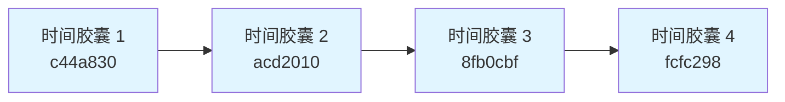
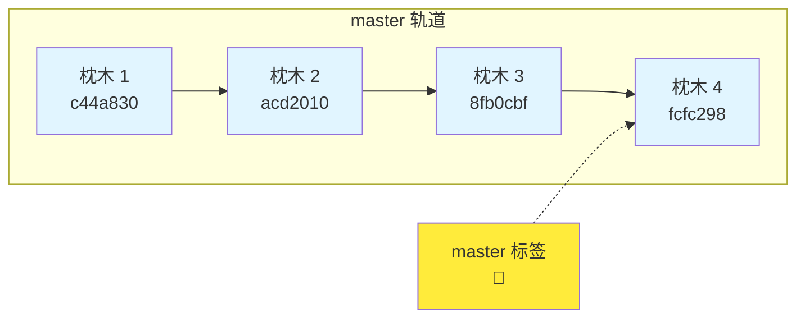
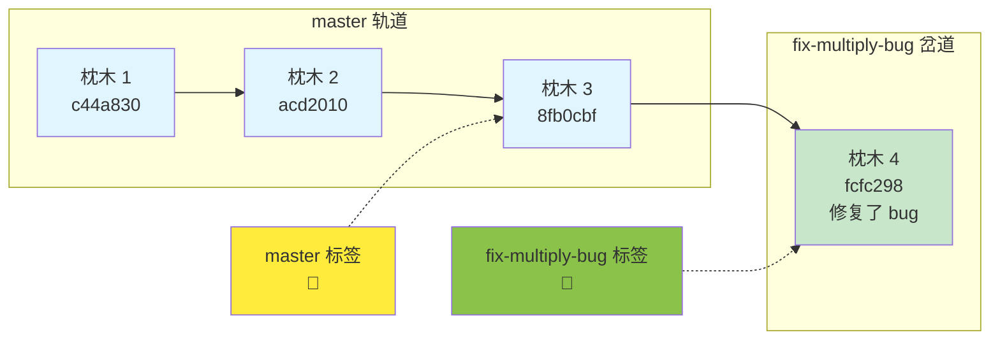
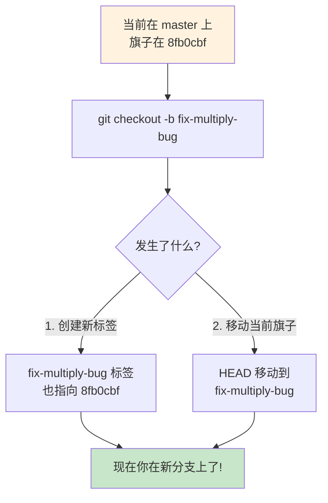
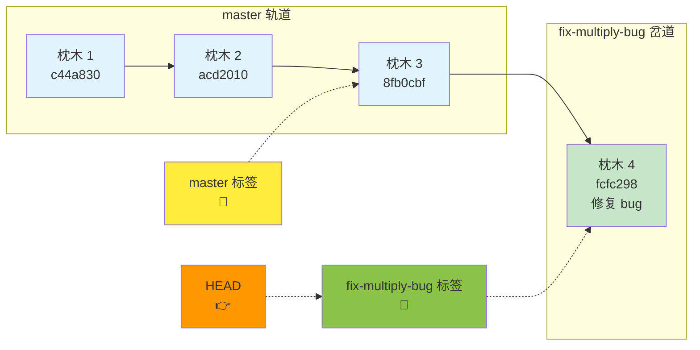
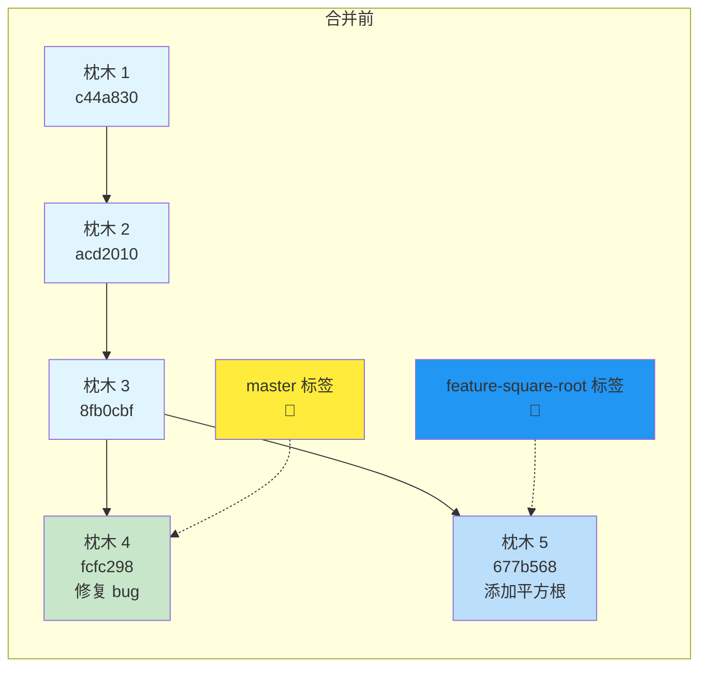
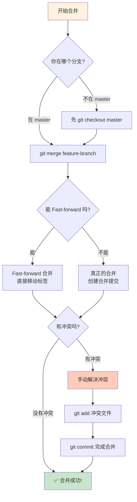

# Git 分支合并超形象化讲解

用类比和图表帮你彻底理解 Git 分支合并！

---

## 一、先理解 Git 的本质

### Git 不是「文件备份」，而是「快照链」

想象每一个 commit 是一个**时间胶囊**：



每个时间胶囊里装着：
- 完整的项目文件
- 是谁提交的
- 什么时候提交的
- 提交信息
- **指向上一个时间胶囊的指针**

---

## 二、分支是什么？

### 分支 =「指向某个时间胶囊的标签」

想象你的项目是一条**火车轨道**，每个 commit 是**铁轨上的枕木**。



**master** 就是一个标签（旗子），它插在最新的枕木上。

---

## 三、创建分支 =「岔出新轨道」

### 类比：修一条岔路

假设你在修一条主路（master），突然想：
- 「我想试试建一个花园，但不确定会不会好看」
- 「如果直接在主路上建，搞砸了主路就乱了」

**解决方案**：从主路岔出一条小路来建花园！



### 实际操作演示



---

## 四、在分支上工作 =「在岔路上铺路」

现在你在 `fix-multiply-bug` 分支上，每次提交都是在给岔路加新枕木：



**关键点**：
- `master` 标签还在原地（8fb0cbf）
- `fix-multiply-bug` 标签向前移动了
- **两个分支互不干扰！**

---

## 五、合并分支 =「把岔路连回主路」

现在岔路修好了（bug 修复了），你想把它连回主路！

### 场景 1：主路没往前走 — Fast-forward 合并

```mermaid
graph LR
    subgraph 合并前
        A1[枕木 1<br/>c44a830] --> B1[枕木 2<br/>acd2010]
        B1 --> C1[枕木 3<br/>8fb0cbf]
        C1 --> D1[枕木 4<br/>fcfc298<br/>修复 bug]
        
        M1[master 标签<br/>🚩] -.-> C1
        F1[fix-multiply-bug 标签<br/>🚩] -.-> D1
    end
    
    subgraph 合并后（Fast-forward）
        A2[枕木 1<br/>c44a830] --> B2[枕木 2<br/>acd2010]
        B2 --> C2[枕木 3<br/>8fb0cbf]
        C2 --> D2[枕木 4<br/>fcfc298<br/>修复 bug]
        
        M2[master 标签<br/>🚩] -.-> D2
        F2[fix-multiply-bug 标签<br/>🚩] -.-> D2
    end
    
    style A1 fill:#e1f5ff
    style B1 fill:#e1f5ff
    style C1 fill:#e1f5ff
    style D1 fill:#c8e6c9
    style M1 fill:#ffeb3b
    style F1 fill:#8bc34a
    
    style A2 fill:#e1f5ff
    style B2 fill:#e1f5ff
    style C2 fill:#e1f5ff
    style D2 fill:#c8e6c9
    style M2 fill:#ffeb3b
    style F2 fill:#8bc34a
```

**Fast-forward 合并**：
- 主路（master）没有新的提交
- 直接把 master 标签「滑」到分支最前面
- **没有创建新的 commit**
- 就像：「哦，原来你已经走那么远了，我直接跟上」

---

### 场景 2：两条路都往前走了 — 真正的合并

现在更复杂的情况：你在修岔路的同时，主路也在往前修！



现在你想把两条路合并：

```mermaid
graph LR
    subgraph 合并后（创建合并提交）
        A[枕木 1<br/>c44a830] --> B[枕木 2<br/>acd2010]
        B --> C[枕木 3<br/>8fb0cbf]
        
        C --> D[枕木 4<br/>fcfc298<br/>修复 bug]
        C --> E[枕木 5<br/>677b568<br/>添加平方根]
        
        D --> Merge[合并枕木<br/>9736950<br/>🎉]
        E --> Merge
        
        M[master 标签<br/>🚩] -.-> Merge
    end
    
    style A fill:#e1f5ff
    style B fill:#e1f5ff
    style C fill:#e1f5ff
    style D fill:#c8e6c9
    style E fill:#bbdefb
    style Merge fill:#fff9c4
    style M fill:#ffeb3b
```

**真正的合并**：
- Git 会创建一个新的「合并 commit」
- 这个 commit 有**两个父 commit**
- Git 会智能合并两边的改动
- 如果改动不冲突，自动合并
- 如果冲突了，需要手动解决

---

## 六、完整的合并流程图



---

## 七、用实际代码看合并

假设我们有两个分支修改了同一个文件的不同部分：

### 分支 A 修改了文件开头：
```python
# calculator.py (在 feature-A 分支上)
def add(a, b):
    """Add two numbers"""  # 新增了注释
    return a + b
```

### 分支 B 修改了文件结尾：
```python
# calculator.py (在 feature-B 分支上)
if __name__ == "__main__":
    print("Hello from feature-B!")  # 新增了这行
    print(f"2 + 3 = {add(2, 3)}")
```

### Git 合并时会自动合并：
```python
# 合并后的 calculator.py
def add(a, b):
    """Add two numbers"""  # 来自分支 A
    return a + b

# ... 其他函数 ...

if __name__ == "__main__":
    print("Hello from feature-B!")  # 来自分支 B
    print(f"2 + 3 = {add(2, 3)}")
```

Git 会说：「哇，你们改了不同的地方，我帮你们拼在一起！」

---

## 八、什么是合并冲突？

如果两个分支**改了同一行代码**，Git 就傻了：

### 分支 A 改了：
```python
def multiply(a, b):
    return a * b  # 分支 A：这是正确的
```

### 分支 B 也改了同一行：
```python
def multiply(a, b):
    return a + b  # 分支 B：我觉得应该这样
```

### Git 会标记冲突：
```python
def multiply(a, b):
<<<<<<< HEAD
    return a * b  # 当前分支（master）的版本
=======
    return a + b  # 要合并的分支的版本
>>>>>>> feature-B
```

Git 会说：「我不知道该用哪个，你自己选吧！」

### 你需要手动解决：
```python
def multiply(a, b):
    return a * b  # 选一个你觉得对的
```

然后：
```bash
git add calculator.py
git commit
```

---

## 九、日常工作流总结

```mermaid
graph LR
    Start[1. 从 master 开始] --> Branch[2. 创建新分支<br/>git checkout -b my-feature]
    
    Branch --> Work[3. 在分支上工作<br/>写代码、提交]
    
    Work --> Ready{4. 功能完成了?}
    
    Ready -->|是| CheckoutMaster[5. 切回 master<br/>git checkout master]
    Ready -->|否| Work
    
    CheckoutMaster --> Pull[6. 拉取最新代码<br/>git pull]
    
    Pull --> Merge[7. 合并分支<br/>git merge my-feature]
    
    Merge --> Conflict{8. 有冲突吗?}
    
    Conflict -->|没有| Push[9. 推送<br/>git push]
    Conflict -->|有| Resolve[手动解决冲突]
    
    Resolve --> AddCommit[git add & git commit]
    AddCommit --> Push
    
    Push --> DeleteBranch[10. 删除分支<br/>git branch -d my-feature]
    
    style Start fill:#fff3e0
    style Push fill:#c8e6c9
    style Resolve fill:#ffccbc
```



---

## 十、记住这些关键点

### ✅ Git 分支的本质：
- **分支只是个标签**（旗子），不是复制整个项目
- 创建分支超级快、超级轻量
- 想创建多少就创建多少

### ✅ 合并的两种方式：
1. **Fast-forward**：主路没动，直接把标签滑过去
2. **真正的合并**：两条路都动了，创建合并 commit

### ✅ 冲突并不可怕：
- Git 会清楚标记哪里冲突了
- 你只需要选一个对的版本就行
- 解决后提交就完事了

---

去项目目录看看真实的合并历史吧！
```bash
cd /Users/wangyu/Documents/项目/git-demo
git log --oneline --graph
```
